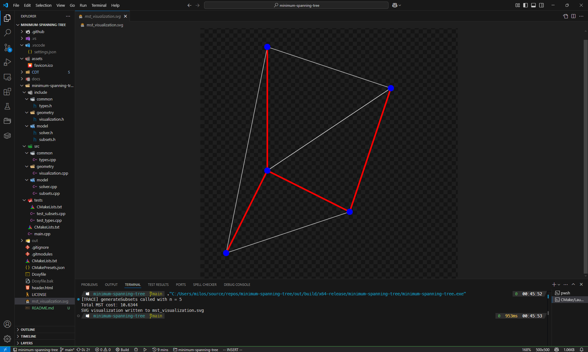

# Minimum Spanning Tree Solver

[](https://github.com/milosz275/minimum-spanning-tree/actions/workflows/codeql.yml)
[](https://github.com/milosz275/minimum-spanning-tree/actions/workflows/doxygen-pages.yml)
[](/LICENSE)



Minimum Spanning Tree Solver is a C++ project that solves the MST problem using a linear programming formulation via IBM CPLEX and visualizes results using CDT (Conforming Delaunay Triangulation).

## Table of Contents

* [Overview](#overview)
* [Problem Formulation](#problem-formulation)
* [Implementation Details](#implementation-details)
* [Usage](#usage)
* [Testing](#testing)
* [Results](#results)
* [Documentation](#documentation)
* [License](#license)

## Overview

This project implements an exact solver for the Minimum Spanning Tree (MST) problem using integer programming (IP). IBM CPLEX is used as the solver backend. Results are visualized with CDT in SVG format, overlaying the MST on a Delaunay triangulation.

## Problem Formulation

We want to find a tree spanning all `n` nodes with minimal total edge cost.

Let `x_ij = 1` if edge `(i, j)` is part of the MST, and `0` otherwise.

### Integer Programming Model:

**Objective:**
Minimize total cost:

```
minimize ∑(i,j)∈E c_ij * x_ij
```

**Constraints:**

1. Tree contains exactly `n - 1` edges:

   ```
   ∑(i,j)∈E x_ij = n - 1
   ```

2. No cycles — subtour elimination:

   ```
   ∑(i,j)∈E, i∈S, j∈S x_ij ≤ |S| - 1   ∀S ⊂ V, |S| ≥ 3
   ```

3. Binary variables:

   ```
   x_ij ∈ {0, 1}
   ```

This is an exponential-size IP, but its LP relaxation has integral extreme points, allowing it to be solved efficiently for MST.

## Implementation Details

* **Language**: C++20
* **Vertices generation**: Uniform distribution in 2D space
* **Solver**: [IBM CPLEX](https://www.ibm.com/products/ilog-cplex-optimization-studio)
* **LP Library**: CPLEX Concert Technology
* **Visualization**: [CDT](https://github.com/artem-ogre/CDT)
* **Testing**: GoogleTest
* **Documentation**: Doxygen

### Subset Generation

To apply the subtour elimination constraint, the solver enumerates all subsets of vertices with size ≥ 3 and < n. For each subset, a constraint is added that limits internal edges to at most `|S| - 1`.

## Usage

Make sure to clone the repository with submodules:

```powershell
git clone --recursive https://github.com/milosz275/minimum-spanning-tree.git
```

If you've already cloned the repository without `--recursive`, run:

```powershell
git submodule update --init --recursive
```

This ensures the `CDT` library is properly initialized.

### VSCode / Visual Studio 2022

CPLEX is automatically located if installed in a standard path.

Simply open the folder in VSCode with the CMake extension, choose `x64-release` preset and run.

### Developer PowerShell for VS

Run the following commands to configure and build the project:

```powershell
cmake --preset x64-release -DCPLEX_ROOT="C:/Program Files/IBM/ILOG/CPLEX_Studio2212"
cmake --build --preset x64-release
.\out\build\x64-release\minimum-spanning-tree\minimum-spanning-tree.exe
```

> Use Developer PowerShell to ensure `cl.exe` and `CPLEX` are in the environment.

## Testing

Tests are located under `minimum-spanning-tree/tests` and cover:

* Subset generation
* Euclidean distance calculations
* Solver output consistency (planned)

To run tests via CLI:

```powershell
ctest --preset x64-release
```

Or run `test_subsets.exe`, `test_common.exe` directly from the build folder.

## Results

The solution is visualized using SVG:

* **Gray edges**: Delaunay triangulation
* **Red edges**: Final MST
* **Blue dots**: Input points (vertices)

Example output:


> Total MST cost: 116.491  
SVG visualization written to mst_visualization.svg

## Documentation

Documentation is auto-generated from docstring via Doxygen and hosted via GitHub Pages:

[View documentation](https://milosz275.github.io/minimum-spanning-tree)

To generate locally:

```powershell
doxygen
```

## License

This project is licensed under the [MIT License](LICENSE).
